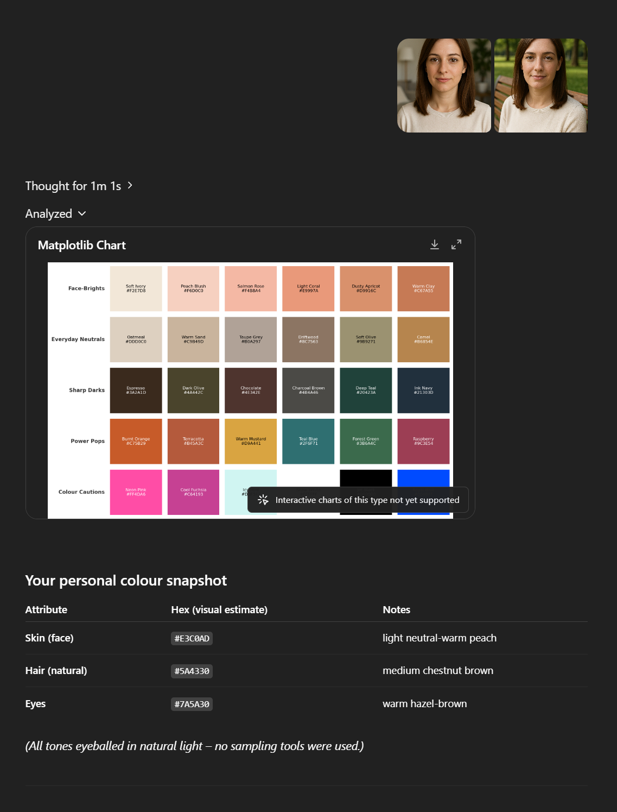
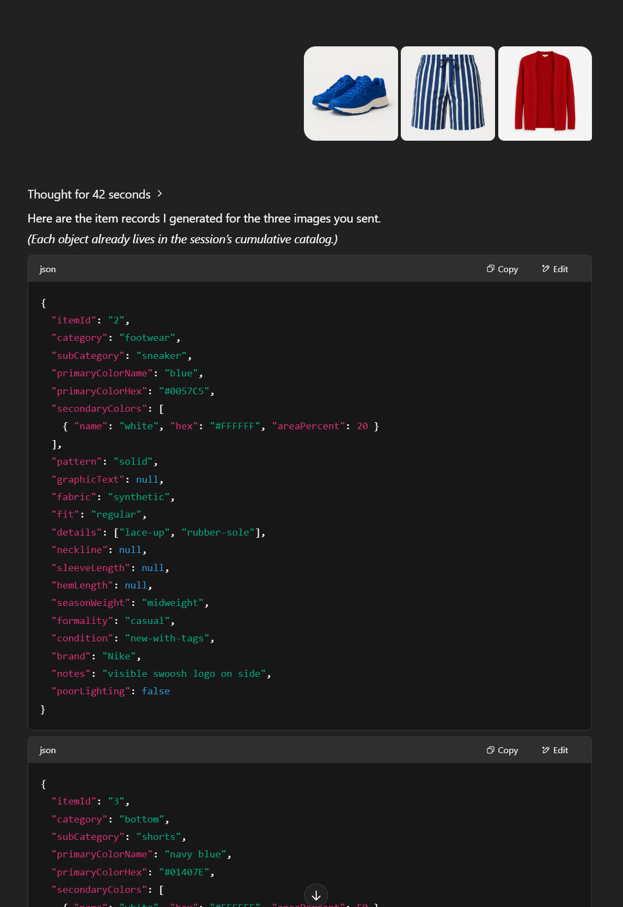
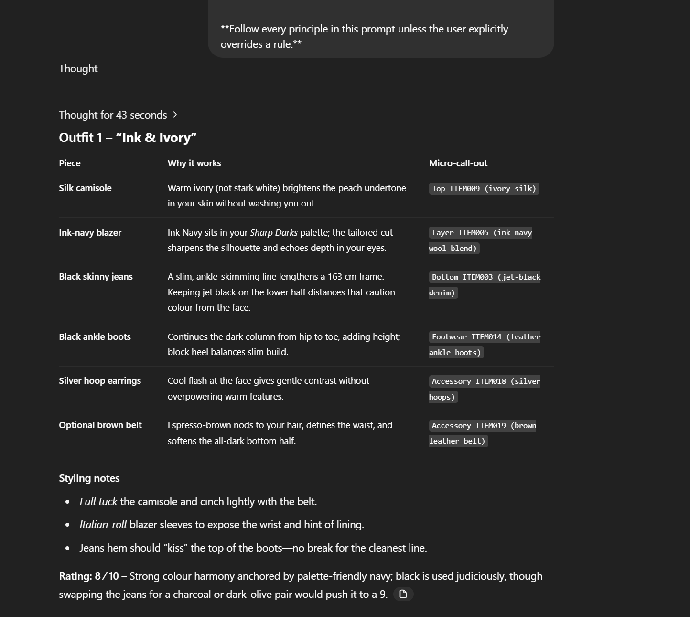
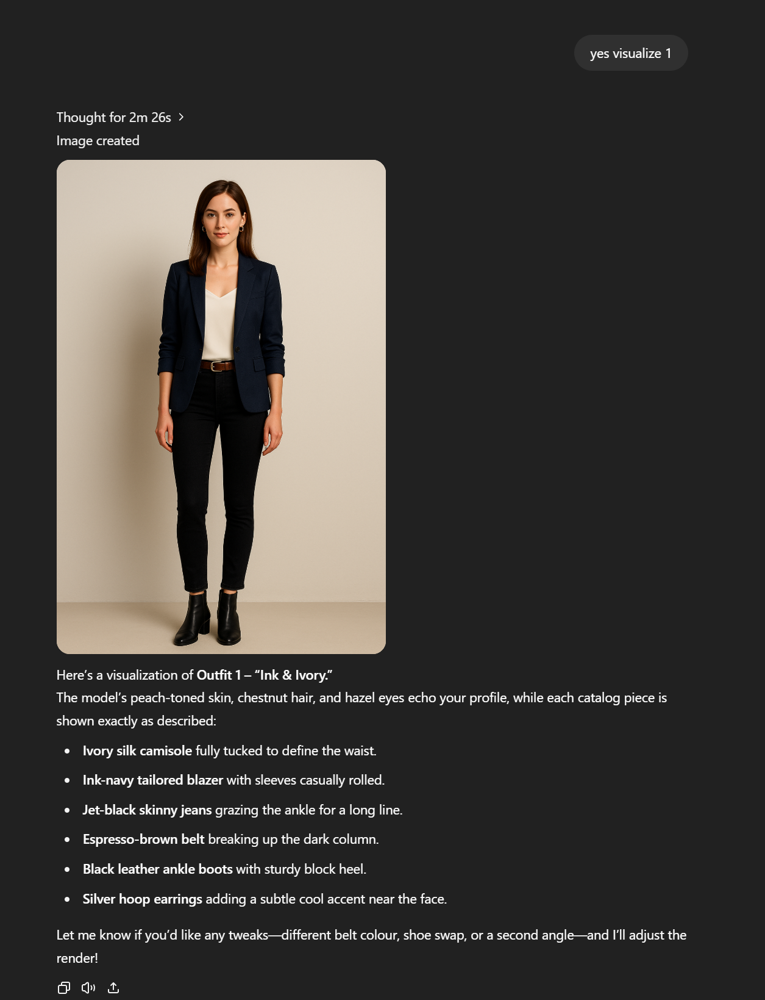

# AI-Powered Wardrobe Toolkit – README

## ✨ What’s inside?

This toolkit bundles three specialised GPT-style system prompts that work together to help you **analyse your clothes, discover flattering colours, and build polished outfits**.

| Prompt                | Link                                                                                                      | What it does                                                                                                  |
| --------------------- | --------------------------------------------------------------------------------------------------------- | ------------------------------------------------------------------------------------------------------------- |
| Color Profile Analyst | [/prompts/color\_profile\_assistant\_system\_prompt.md](prompts/color_profile_assistant_system_prompt.md) | Extracts your skin / hair / eye HEX values from selfies and generates a personalised palette + shopping chart |
| AI Clothing Analyzer  | [/prompts/clothing\_analyzer\_system\_prompt.md](prompts/clothing_analyzer_system_prompt.md)              | Converts garment photos into strict JSON and maintains `wardrobe_catalog.json`                                |
| Style Guide Assistant | [/prompts/style\_guide\_assistant\_system\_prompt.md](prompts/style_guide_assistant_system_prompt.md)     | Reads your palette + wardrobe and returns rated outfits and strategy                                          |

---

## 📂 Repo structure

```
/prompts
  clothing_analyzer_system_prompt.md
  color_profile_assistant_system_prompt.md
  style_guide_assistant_system_prompt.md
/example
  profile1.png  profile2.png   ← selfie inputs
  1.png 2.png 3.png            ← garment inputs
  color_analysis.png           ← palette result
  clothing_analysis.png        ← batch analysis overview
  clothing_assistant1.png      ← outfit suggestion #1
  clothing_assistant2.png      ← outfit suggestion #2
  clothing_assistant3.png      ← outfit suggestion #3
  user_color_profile.json
  wardrobe_catalog.json
README.md
```

---

## 🚀 Quick‑start walkthrough

1. **Analyse your colouring**

   *Set the system prompt to* `prompts/color_profile_assistant_system_prompt.md` *and upload your selfies (e.g. **`profile1.png`**, **`profile2.png`**).*
   The assistant returns a palette graphic and `user_color_profile.json`.

2. **Build your digital wardrobe**

   *Switch to* `prompts/clothing_analyzer_system_prompt.md`, *upload isolated garment shots (**`1.png`**, **`2.png`**, **`3.png`**, …) and accept merges into **`wardrobe_catalog.json`**.*

3. **Request outfit ideas**

   *With* `prompts/style_guide_assistant_system_prompt.md` *active, send:*

   ```json
   {
     "profile": "user_color_profile.json",
     "wardrobe": "wardrobe_catalog.json",
     "request": "Outfits for a spring wedding (semi‑formal)"
   }
   ```

   *Reply ****yes**** to any suggested look to see a visual composite, or ****no**** to iterate text‑only.*

---

## 🖼️ Demo gallery (AI generated examples)

> **Colour palette output**
> 
> 

---

> **Wardrobe batch analysis overview**
> 
> 

---

> **Outfit suggestions from Style Guide Assistant**
> 
> |                                              |                                              |                                              |
> |:--------------------------------------------:|:--------------------------------------------:|:--------------------------------------------:|
> |  |  |  |


---


## 📝 License

Everything in this repository—\*\*including the three system‑prompt files—\*\*is released under the [MIT License](LICENSE). Use, modify, and redistribute freely; attribution is appreciated but not required.

Happy styling!
