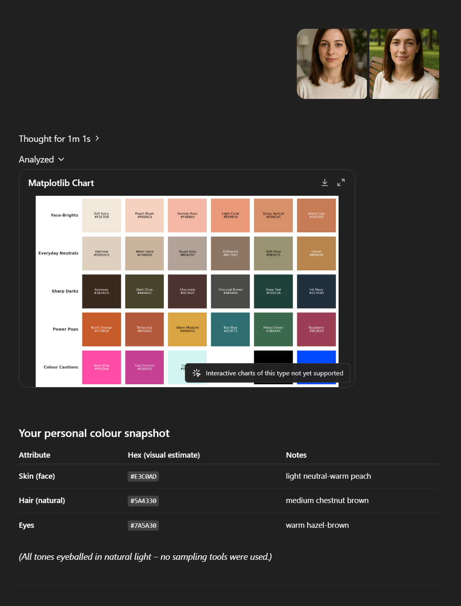
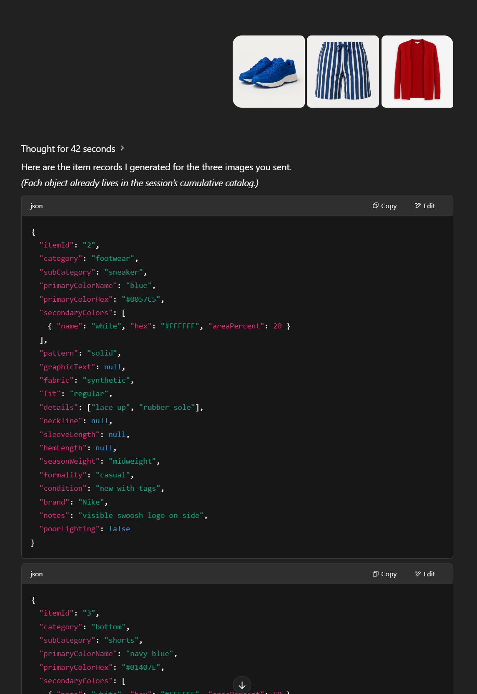

Siin on eestikeelne variant:

# Tehisintellekti-põhine garderoobi tööriistakomplekt

## ✨ Mida see sisaldab?

See tööriistakomplekt koondab kolme spetsialiseeritud GPT-stiilis süsteemiviipa, mis teevad koostööd, et aidata sul **oma riideid analüüsida, sobivaid värve avastada ja viimistletud komplekte koostada**.

| Viip                      | Link                                                                                                         | Mida see teeb                                                                                                        |
| ------------------------- | ------------------------------------------------------------------------------------------------------------ | -------------------------------------------------------------------------------------------------------------------- |
| Värviprofiili analüsaator | [/prompts/color\_profile\_assistant\_system\_prompt.md](prompts/color_profile_assistant_system_prompt.md)      | Eraldab selfidest sinu naha / juuste / silmade HEX-väärtused ning genereerib personaliseeritud värvipaleti + ostunimekirja. |
| TI Rõivaanalüsaator       | [/prompts/clothing\_analyzer\_system\_prompt.md](prompts/clothing_analyzer_system_prompt.md)                 | Teisendab rõivaesemete fotod rangelt JSON-vormingusse ja haldab `wardrobe_catalog.json` faili.                         |
| Stiilijuhendi assistent   | [/prompts/style\_guide\_assistant\_system\_prompt.md](prompts/style_guide_assistant_system_prompt.md)        | Loeb sinu värvipaletti + garderoobi ning tagastab hinnatud komplekte ja strateegia.                                  |

---

## 📂 Repositooriumi struktuur

```
/prompts
  clothing_analyzer_system_prompt.md
  color_profile_assistant_system_prompt.md
  style_guide_assistant_system_prompt.md
/example
  profile1.png  profile2.png   ← selfi sisendid
  1.png 2.png 3.png            ← rõivaesemete sisendid
  color_analysis.png           ← värvipaleti tulemus
  clothing_analysis.png        ← pakettanalüüsi ülevaade
  clothing_assistant1.png      ← komplekti soovitus nr 1
  clothing_assistant2.png      ← komplekti soovitus nr 2
  clothing_assistant3.png      ← komplekti soovitus nr 3
  user_color_profile.json
  wardrobe_catalog.json
readme.md
```

---

## 🚀 Kiirjuhend

1.  **Analüüsi oma värvitüüpi**

    *Määra süsteemiviibaks* `prompts/color_profile_assistant_system_prompt.md` *ja lae üles oma selfid (nt **`profile1.png`**, **`profile2.png`**).*
    Assistent tagastab värvipaleti graafiku ja `user_color_profile.json` faili.

2.  **Koosta oma digitaalne garderoob**

    *Vaheta süsteemiviibaks* `prompts/clothing_analyzer_system_prompt.md`, *lae üles eraldiseisvad rõivaesemete pildid (**`1.png`**, **`2.png`**, **`3.png`**, …).*
    Parimate piltide saamiseks proovi neid teha loomulikus valguses või leia originaalsed tootepildid Google'i pöördotsingu abil.
    Assistent tagastab kirjeldatud objektid ja täieliku garderoobifaili `wardrobe_catalog.json`.

4.  **Küsi komplektiideid**

    *Kui* `prompts/style_guide_assistant_system_prompt.md` *on aktiivne, saada:*

    ```json
    Komplektid kevadiseks pulmapeoks (poolformaalne), 
    + garderoobi ja värviprofiili fail
    ```

    *Visuaalse koondi nägemiseks vasta soovitatud välimusele ****jah****, või tekstipõhiseks kordamiseks ****ei****.*

Märkus: kogu garderoobi- ja profiili-JSONi edastamine LLM-ile tekstina võib toimida paremini kui nende esitamine projektifailidena, kuna LLM-mudelid mahutavad tavaliselt kogu info oma kontekstiaknasse ega pea nende otsimiseks analüütilisi tööriistu kasutama.

---

## 🖼️ Demogalerii (tehisintellekti genereeritud näited)

> **Värvipaleti väljund**
>
> 

---

> **Garderoobi pakettanalüüsi ülevaade**
>
> 

---

> **Stiilijuhendi assistendi komplektisoovitused**
>
> |                                                  |                                                  |                                                  |
> |:------------------------------------------------:|:------------------------------------------------:|:------------------------------------------------:|
> |  |  |  |

---

## 📝 Litsents

Kõik selles repositooriumis – **kaasa arvatud kolm süsteemiviiba faili** – on avaldatud [MIT litsentsi](LICENSE) all. Kasuta, muuda ja levita vabalt; viitamine on teretulnud, kuid mitte kohustuslik.

Head stiliseerimist!
